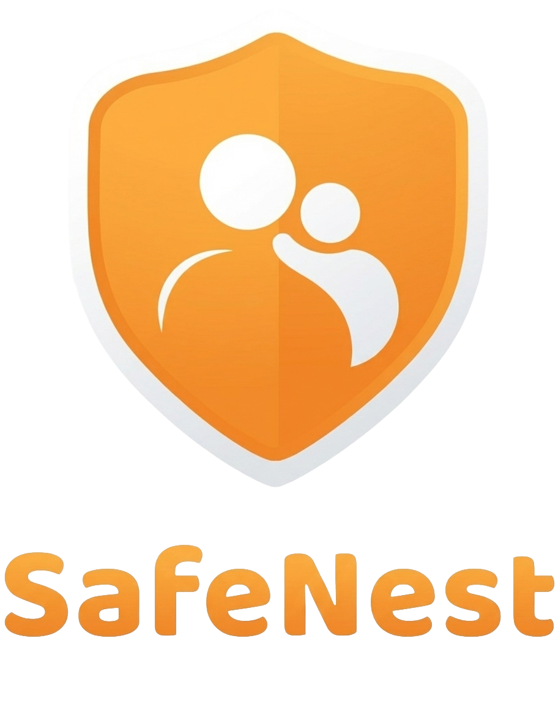

<p align="center">
  
</p>

<h1 align="center">Tuteliq MCP Server</h1>

<p align="center">
  <strong>MCP server for Tuteliq - AI-powered child safety tools for Claude</strong>
</p>

<p align="center">
  <a href="https://www.npmjs.com/package/@tuteliq/mcp"></a>
  <a href="https://github.com/Tuteliq/mcp/blob/main/LICENSE"></a>
</p>

<p align="center">
  <a href="https://docs.tuteliq.ai">API Docs</a> •
  <a href="https://tuteliq.ai">Dashboard</a> •
  <a href="https://trust.tuteliq.ai">Trust</a> •
  <a href="https://discord.gg/7kbTeRYRXD">Discord</a>
</p>

---

## What is this?

Tuteliq MCP Server brings AI-powered child safety tools directly into Claude, Cursor, and other MCP-compatible AI assistants. Ask Claude to check messages for bullying, detect grooming patterns, or generate safety action plans.

## Available Tools (41 MCP + 2 API-only)

### Safety Detection

| Tool | Description |
|------|-------------|
| `detect_bullying` | Analyze text for bullying, harassment, or harmful language |
| `detect_grooming` | Detect grooming patterns and predatory behavior in conversations |
| `detect_unsafe` | Identify unsafe content (self-harm, violence, explicit material) |
| `analyze` | Quick comprehensive safety check (bullying + unsafe) |
| `analyse_multi` | Run multiple detection endpoints on a single piece of text in one call |
| `analyze_emotions` | Analyze emotional content and mental state indicators |
| `get_action_plan` | Generate age-appropriate guidance for safety situations |
| `generate_report` | Create incident reports from conversations |

### Fraud & Harm Detection

| Tool | Description |
|------|-------------|
| `detect_social_engineering` | Detect social engineering tactics (pretexting, urgency fabrication, authority impersonation) |
| `detect_app_fraud` | Detect app-based fraud (fake investment platforms, phishing apps, subscription traps) |
| `detect_romance_scam` | Detect romance scam patterns (love-bombing, financial requests, identity deception) |
| `detect_mule_recruitment` | Detect money mule recruitment tactics (easy-money offers, bank account sharing) |
| `detect_gambling_harm` | Detect gambling-related harm indicators (chasing losses, concealment, distress) |
| `detect_coercive_control` | Detect coercive control patterns (isolation, financial control, monitoring, threats) |
| `detect_vulnerability_exploitation` | Detect exploitation of vulnerable individuals (elderly, disabled, financially distressed) |
| `detect_radicalisation` | Detect radicalisation indicators (extremist rhetoric, us-vs-them framing, ideological grooming) |

### Voice, Image & Video Analysis

| Tool | Description |
|------|-------------|
| `analyze_voice` | Transcribe audio and run safety analysis on the transcript |
| `analyze_image` | Analyze images for visual safety + OCR text extraction |
| `analyze_video` | Analyze video files for safety concerns via key frame extraction (supports mp4, mov, avi, webm, mkv) |

### Webhook Management

| Tool | Description |
|------|-------------|
| `list_webhooks` | List all configured webhooks |
| `create_webhook` | Create a new webhook endpoint |
| `update_webhook` | Update webhook configuration |
| `delete_webhook` | Delete a webhook |
| `test_webhook` | Send a test payload to verify webhook |
| `regenerate_webhook_secret` | Regenerate webhook signing secret |

### Pricing

| Tool | Description |
|------|-------------|
| `get_pricing` | Get available pricing plans |
| `get_pricing_details` | Get detailed pricing with features and limits |

### Usage & Billing

| Tool | Description |
|------|-------------|
| `get_usage_history` | Get daily usage history |
| `get_usage_by_tool` | Get usage by tool/endpoint |
| `get_usage_monthly` | Get monthly usage with billing info |

### GDPR Account

| Tool | Description |
|------|-------------|
| `delete_account_data` | Delete all account data (Right to Erasure) |
| `export_account_data` | Export all account data as JSON (Data Portability) |
| `record_consent` | Record user consent for data processing |
| `get_consent_status` | Get current consent status |
| `withdraw_consent` | Withdraw a previously granted consent |
| `rectify_data` | Correct user data (Right to Rectification) |
| `get_audit_logs` | Get audit trail of all data operations |

### Breach Management

| Tool | Description |
|------|-------------|
| `log_breach` | Log a new data breach (starts 72-hour notification clock) |
| `list_breaches` | List all data breaches, optionally filtered by status |
| `get_breach` | Get details of a specific data breach |
| `update_breach_status` | Update breach status and notification progress |

### Verification (API & SDK only)

These tools are available via the [REST API](https://docs.tuteliq.ai) and the [@tuteliq/sdk](https://www.npmjs.com/package/@tuteliq/sdk) Node SDK — not yet exposed as MCP tools.

| Tool | Description |
|------|-------------|
| `verify_age` | Verify a user's age via document analysis, biometric estimation, or both. Methods: `document`, `biometric`, `combined`. Returns verified age range, confidence score, and minor status. Beta — requires Pro tier. 5 credits per call. |
| `verify_identity` | Confirm user identity with document authentication, face matching, and liveness detection. Returns match score, liveness result, and document authentication status. Beta — requires Business tier. 10 credits per call. |

---

## Common Parameters

### Context Fields

All detection tools accept an optional `context` object. These fields influence severity scoring and classification:

| Field | Type | Description |
|-------|------|-------------|
| `language` | `string` | ISO 639-1 code (e.g., `"en"`, `"sv"`). Auto-detected if omitted. |
| `ageGroup` | `string` | Age group (e.g., `"10-12"`, `"13-15"`, `"under 18"`). Triggers age-calibrated scoring. |
| `platform` | `string` | Platform name (e.g., `"Discord"`, `"Roblox"`). Adjusts detection for platform norms. |
| `relationship` | `string` | Relationship context (e.g., `"classmates"`, `"stranger"`). |
| `sender_trust` | `string` | Sender verification status: `"verified"`, `"trusted"`, or `"unknown"`. |
| `sender_name` | `string` | Name of the sender (used with `sender_trust`). |

#### `sender_trust` Behavior

When `sender_trust` is set to `"verified"` or `"trusted"`:
- **AUTH_IMPERSONATION** is fully suppressed — a verified sender cannot be impersonating an authority
- **URGENCY_FABRICATION** is suppressed for routine time-sensitive information (schedules, deadlines, appointments)
- Content is only flagged if it contains genuinely malicious elements (credential theft, phishing links, financial demands)
- This prevents false positives on legitimate institutional messages (school notifications, hospital reminders, government advisories)

### `support_threshold`

Controls when crisis support resources (helplines, text lines, web resources) are included in the response:

| Value | Behavior |
|-------|----------|
| `low` | Include support for Low severity and above |
| `medium` | Include support for Medium severity and above |
| `high` | **(Default)** Include support for High severity and above |
| `critical` | Include support only for Critical severity |

> **Note:** Critical severity **always** includes support resources regardless of the threshold setting.

### `analyse_multi` Endpoint Values

The `analyse_multi` tool accepts up to 10 endpoints per call. Valid endpoint values:

| Endpoint ID | Description |
|-------------|-------------|
| `bullying` | Bullying and harassment detection |
| `grooming` | Grooming pattern detection |
| `unsafe` | Unsafe content detection (self-harm, violence, explicit material) |
| `social-engineering` | Social engineering and pretexting |
| `app-fraud` | App-based fraud patterns |
| `romance-scam` | Romance scam patterns |
| `mule-recruitment` | Money mule recruitment |
| `gambling-harm` | Gambling-related harm |
| `coercive-control` | Coercive control patterns |
| `vulnerability-exploitation` | Exploitation of vulnerable individuals |
| `radicalisation` | Radicalisation indicators |

---

## Installation

### Claude Desktop (Recommended)

1. Open Claude Desktop and go to **Settings > Connectors**
2. Click **Add custom connector**
3. Set the name to **Tuteliq** and the URL to:
   ```
   https://api.tuteliq.ai/mcp
   ```
4. When prompted, enter your Tuteliq API key

That's it — Tuteliq tools will be available in your next conversation.

### Cursor

Add to your Cursor MCP settings:

```json
{
  "mcpServers": {
    "tuteliq": {
      "url": "https://api.tuteliq.ai/mcp",
      "headers": {
        "Authorization": "Bearer your-api-key"
      }
    }
  }
}
```

### Other MCP clients (npx)

For clients that support stdio transport:

```json
{
  "mcpServers": {
    "tuteliq": {
      "command": "npx",
      "args": ["-y", "@tuteliq/mcp"],
      "env": {
        "TUTELIQ_API_KEY": "your-api-key"
      }
    }
  }
}
```

---

## Usage Examples

Once configured, you can ask Claude:

### Bullying Detection
> "Check if this message is bullying: 'Nobody likes you, just go away'"

**Response:**
```
## ⚠️ Bullying Detected

**Severity:** 🟠 Medium
**Confidence:** 92%
**Risk Score:** 75%

**Types:** exclusion, verbal_abuse

### Rationale
The message contains direct exclusionary language...

### Recommended Action
`flag_for_moderator`
```

### Grooming Detection
> "Analyze this conversation for grooming patterns..."

### Quick Safety Check
> "Is this message safe? 'I don't want to be here anymore'"

### Emotion Analysis
> "Analyze the emotions in: 'I'm so stressed about school and nobody understands'"

### Action Plan
> "Give me an action plan for a 12-year-old being cyberbullied"

### Incident Report
> "Generate an incident report from these messages..."

### Voice Analysis
> "Analyze this audio file for safety: /path/to/recording.mp3"

### Image Analysis
> "Check this screenshot for harmful content: /path/to/screenshot.png"

### Webhook Management
> "List my webhooks"
> "Create a webhook for critical incidents at https://example.com/webhook"

### Usage
> "Show my monthly usage"

### Fraud Detection
> "Check this message for social engineering: 'Your account will be suspended unless you verify now'"
> "Is this a romance scam? 'I know we just met online but I need help with a medical bill'"

---

## Get Started (Free)

1. [Create a free Tuteliq account](https://tuteliq.ai)
2. Go to your [Dashboard](https://tuteliq.ai/dashboard) and generate an **API Key**
3. For Claude Desktop and other MCP plugins, generate a **Secure Token** under **Settings > Plugins**
4. Use the API key for direct API/SDK access, or the Secure Token when connecting via MCP

---

## Requirements

- Node.js 18+
- Tuteliq API key

---

## Supported Languages (27)

Language is auto-detected when not specified. Beta languages have good accuracy but may have edge cases compared to English.

| Language | Code | Status |
|----------|------|--------|
| English | `en` | Stable |
| Spanish | `es` | Beta |
| Portuguese | `pt` | Beta |
| French | `fr` | Beta |
| German | `de` | Beta |
| Italian | `it` | Beta |
| Dutch | `nl` | Beta |
| Polish | `pl` | Beta |
| Romanian | `ro` | Beta |
| Turkish | `tr` | Beta |
| Greek | `el` | Beta |
| Czech | `cs` | Beta |
| Hungarian | `hu` | Beta |
| Bulgarian | `bg` | Beta |
| Croatian | `hr` | Beta |
| Slovak | `sk` | Beta |
| Slovenian | `sl` | Beta |
| Lithuanian | `lt` | Beta |
| Latvian | `lv` | Beta |
| Estonian | `et` | Beta |
| Maltese | `mt` | Beta |
| Irish | `ga` | Beta |
| Swedish | `sv` | Beta |
| Norwegian | `no` | Beta |
| Danish | `da` | Beta |
| Finnish | `fi` | Beta |
| Ukrainian | `uk` | Beta |

---

## Best Practices

### Message Batching

The **bullying** and **unsafe content** tools analyze a single `text` field per request. If you're analyzing a conversation, concatenate a **sliding window of recent messages** into one string rather than sending each message individually. Single words or short fragments lack context for accurate detection and can be exploited to bypass safety filters.

The **grooming** tool already accepts a `messages[]` array and analyzes the full conversation in context.

### PII Redaction

Enable `PII_REDACTION_ENABLED=true` on your Tuteliq API to automatically strip emails, phone numbers, URLs, social handles, IPs, and other PII from detection summaries and webhook payloads. The original text is still analyzed in full — only stored outputs are scrubbed.

---

## Supported Languages

Tuteliq supports **27 languages** with automatic detection — no configuration required.

**English** (stable) and **26 beta languages**: Spanish, Portuguese, Ukrainian, Swedish, Norwegian, Danish, Finnish, German, French, Dutch, Polish, Italian, Turkish, Romanian, Greek, Czech, Hungarian, Bulgarian, Croatian, Slovak, Lithuanian, Latvian, Estonian, Slovenian, Maltese, and Irish.

All 24 EU official languages + Ukrainian, Norwegian, and Turkish. Each language includes culture-specific safety guidelines covering local slang, grooming patterns, self-harm coded vocabulary, and filter evasion techniques.

See the [Language Support docs](https://docs.tuteliq.ai/languages) for details.

---

## Support

- **API Docs**: [docs.tuteliq.ai](https://docs.tuteliq.ai)
- **Discord**: [discord.gg/7kbTeRYRXD](https://discord.gg/7kbTeRYRXD)
- **Email**: support@tuteliq.ai

---

## License

MIT License - see [LICENSE](LICENSE) for details.

---

## Get Certified — Free

Tuteliq offers a **free certification program** for anyone who wants to deepen their understanding of online child safety. Complete a track, pass the quiz, and earn your official Tuteliq certificate — verified and shareable.

**Three tracks available:**

| Track | Who it's for | Duration |
|-------|-------------|----------|
| **Parents & Caregivers** | Parents, guardians, grandparents, teachers, coaches | ~90 min |
| **Young People (10–16)** | Young people who want to learn to spot manipulation | ~60 min |
| **Companies & Platforms** | Product managers, trust & safety teams, CTOs, compliance officers | ~120 min |

**Start here →** [tuteliq.ai/certify](https://tuteliq.ai/certify)

- 100% Free — no login required
- Verifiable certificate on completion
- Covers grooming recognition, sextortion, cyberbullying, regulatory obligations (KOSA, EU DSA), and more

---

## The Mission: Why This Matters

Before you decide to contribute or sponsor, read these numbers. They are not projections. They are not estimates from a pitch deck. They are verified statistics from the University of Edinburgh, UNICEF, NCMEC, and Interpol.

- **302 million** children are victims of online sexual exploitation and abuse every year. That is **10 children every second**. *(Childlight / University of Edinburgh, 2024)*
- **1 in 8** children globally have been victims of non-consensual sexual imagery in the past year. *(Childlight, 2024)*
- **370 million** girls and women alive today experienced rape or sexual assault in childhood. An estimated **240–310 million** boys and men experienced the same. *(UNICEF, 2024)*
- **29.2 million** incidents of suspected child sexual exploitation were reported to NCMEC's CyberTipline in 2024 alone — containing **62.9 million files** (images, videos). *(NCMEC, 2025)*
- **546,000** reports of online enticement (adults grooming children) in 2024 — a **192% increase** from the year before. *(NCMEC, 2025)*
- **1,325% increase** in AI-generated child sexual abuse material reports between 2023 and 2024. The technology that should protect children is being weaponized against them. *(NCMEC, 2025)*
- **100 sextortion reports per day** to NCMEC. Since 2021, at least **36 teenage boys** have taken their own lives because they were victimized by sextortion. *(NCMEC, 2025)*
- **84%** of reports resolve outside the United States. This is not an American problem. This is a **global emergency**. *(NCMEC, 2025)*

End-to-end encryption is making platforms blind. In 2024, platforms reported **7 million fewer incidents** than the year before — not because abuse stopped, but because they can no longer see it. The tools that catch known images are failing. The systems that rely on human moderators are overwhelmed. The technology to detect behavior — grooming patterns, escalation, manipulation — in real-time text conversations **exists right now**. It is running at [api.tuteliq.ai](https://api.tuteliq.ai).

The question is not whether this technology is possible. The question is whether we build the company to put it everywhere it needs to be.

**Every second we wait, another child is harmed.**

We have the technology. We need the support.

If this mission matters to you, consider [sponsoring our open-source work](https://github.com/sponsors/Tuteliq) so we can keep building the tools that protect children — and keep them free and accessible for everyone.

---

<p align="center">
  <sub>Built with care for child safety by the <a href="https://tuteliq.ai">Tuteliq</a> team</sub>
</p>
