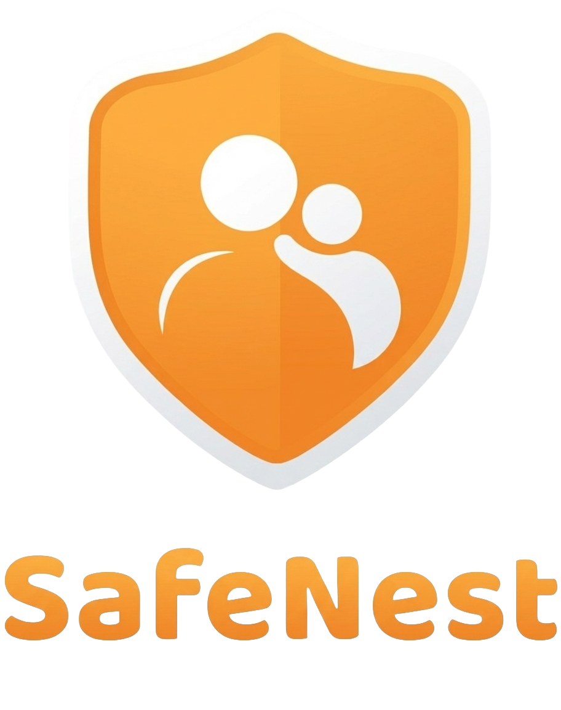

<p align="center">
  
</p>

<h1 align="center">Tuteliq MCP Server</h1>

<p align="center">
  <strong>MCP server for Tuteliq - AI-powered child safety tools for Claude</strong>
</p>

<p align="center">
  <a href="https://www.npmjs.com/package/@tuteliq/mcp"></a>
  <a href="https://github.com/Tuteliq/mcp/blob/main/LICENSE"></a>
</p>

<p align="center">
  <a href="https://docs.tuteliq.ai">API Docs</a> •
  <a href="https://tuteliq.ai">Dashboard</a> •
  <a href="https://trust.tuteliq.ai">Trust</a> •
  <a href="./CHANGELOG.md">Changelog</a> •
  <a href="https://discord.gg/7kbTeRYRXD">Discord</a>
</p>

---

## What is this?

Tuteliq MCP Server brings AI-powered child safety tools directly into Claude, Cursor, and other MCP-compatible AI assistants. Ask Claude to check messages for bullying, detect grooming patterns, or generate safety action plans.

**Reads context, not just keywords.** Every detector understands coded slang, emoji, leetspeak, algospeak, and deliberate filter evasion, and weighs the conversation around a message — so it tells gaming trash-talk apart from targeted harassment instead of drowning your team in false positives. This coded-language resilience is platform-wide (it applies to grooming, fraud, radicalisation, and the rest, not just bullying) and is built from our own research into how bad actors evade moderation. In an internal benchmark of coded-language and filter-evasion cases, Tuteliq detected roughly **1.7x more** of them than leading general-purpose moderation APIs (319-case evasion set; vendors unnamed).

**Fast mode.** Pass `verdict_only: true` on `detect_grooming` or `detect_bullying` to get just the verdict (risk level, flags, recommended action) without the per-message breakdown — lower latency for real-time screening. The verdict itself is unchanged.

**Interactive results.** In hosts that support MCP Apps, results render as interactive cards rather than walls of JSON — see [Interactive widgets](#interactive-widgets) below.

## Interactive widgets

Twelve widgets return a rendered card instead of raw text in hosts that support MCP
Apps (Claude desktop and web, and other MCP-compatible clients). Everywhere else
the same data arrives as `structuredContent`, so nothing depends on the UI.

Every card carries the same frame: a chrome bar naming the tool that produced the
result, the result itself, and a footer with the data-handling note and a Trust
Center link. In a transcript holding a dozen results, the chrome bar is what tells
you which is which.

| Widget | Tools |
|--------|-------|
| Detection result | `detect_bullying`, `detect_grooming`, `detect_unsafe`, `analyze`, and the other `detect_*` tools |
| Multi-endpoint | `analyse_multi` |
| Emotions | `analyze_emotions` |
| Media | `analyze_voice`, `analyze_image`, `analyze_video`, `analyze_document` |
| Synthetic media | `detect_synthetic_text`, `detect_synthetic_image`, `detect_synthetic_audio`, `detect_synthetic_video` |
| Action plan | `get_action_plan` |
| Incident report | `generate_report` |
| Incidents overview | `get_incidents_overview` |
| Incidents list | `list_incidents` |
| Incident detail | `get_incident` |
| Incident trends | `get_incident_trends` |
| Moderation queue | `moderation_queue` |

**Severity is rankable by colour.** The ramp runs monotonically from safe to
critical, so two chips can be compared without reading their labels:

| Level | Colour | |
|---|---|---|
| `critical` | `#9C3A29` |  |
| `high` | `#C2543A` |  |
| `medium` | `#D98A3D` |  |
| `low` | `#B7C2D4` |  |
| `safe` | `#19B79A` |  |

**Design notes.** The widgets are deliberately calm. They report on grooming,
self-harm, and abuse, and a card that animates or pulses at the reader turns
material that is already distressing into an alarm they cannot dismiss. Severity
is carried by a rule and a glyph, not by motion. The crisis-support card leads
with reassurance rather than the severity colour, and its helpline numbers are the
largest targets on the card because transcribing digits under stress is where
people fail.

Widgets are read-only renderers by design. Selecting incidents in the list widget
assembles the ID list for a `batch_review_incidents` call you fire yourself — the
mutating call still goes through your host's approval step, so the
human-in-the-loop stays in the loop.

### Working on the widgets

```bash
npm run preview:ui   # builds every widget against fixture data
open dist-preview/__preview.html
```

Widget source lives in `ui/src`. Design tokens are centralised in
`ui/src/theme.ts`; prefer them over colour literals so the palette stays in one
place.

## Available Tools (81 MCP)

### Safety Detection

| Tool | Description |
|------|-------------|
| `detect_bullying` | Analyze text for bullying, harassment, and gaming toxicity — including coded slang, emoji, and deliberate filter evasion, with context that tells trash-talk apart from genuine harm |
| `detect_grooming` | Detect grooming patterns and predatory behavior in conversations |
| `detect_unsafe` | Identify unsafe content (self-harm, violence, explicit material) |
| `analyze` | Quick comprehensive safety check (bullying + unsafe) |
| `analyse_multi` | Run multiple detection endpoints on a single piece of text in one call |
| `batch_analyze` | Analyze up to 50 items in a single request — all twelve detection types (bullying, grooming, unsafe, emotions, social_engineering, app_fraud, romance_scam, mule_recruitment, gambling_harm, coercive_control, vulnerability_exploitation, radicalisation) — ideal for bulk triage |
| `analyze_emotions` | Analyze emotional content and mental state indicators — accepts single text or full conversations |
| `get_action_plan` | Generate age-appropriate guidance for safety situations |
| `generate_report` | Create incident reports from conversations |

### Fraud & Harm Detection

| Tool | Description |
|------|-------------|
| `detect_social_engineering` | Detect social engineering tactics (pretexting, urgency fabrication, authority impersonation) |
| `detect_app_fraud` | Detect app-based fraud (fake investment platforms, phishing apps, subscription traps) |
| `detect_romance_scam` | Detect romance scam patterns (love-bombing, financial requests, identity deception) |
| `detect_mule_recruitment` | Detect money mule recruitment tactics (easy-money offers, bank account sharing) |
| `detect_gambling_harm` | Detect gambling-related harm indicators (chasing losses, concealment, distress) |
| `detect_coercive_control` | Detect coercive control patterns (isolation, financial control, monitoring, threats) |
| `detect_vulnerability_exploitation` | Detect exploitation of vulnerable individuals (elderly, disabled, financially distressed) |
| `detect_radicalisation` | Detect radicalisation indicators (extremist rhetoric, us-vs-them framing, ideological grooming) |

### Voice, Image, Video & Document Analysis

| Tool | Description |
|------|-------------|
| `analyze_voice` | Transcribe audio and run safety analysis on the transcript |
| `analyze_image` | Analyze images for visual safety + OCR text extraction |
| `analyze_video` | Analyze video files for safety concerns via key frame extraction (supports mp4, mov, avi, webm, mkv) |
| `analyze_document` | Analyze PDF documents for safety concerns — per-page multi-endpoint detection with chain-of-custody hashing (max 50MB, 100 pages) |

### Synthetic Content Detection

| Tool | Description |
|------|-------------|
| `detect_synthetic_text` | Detect AI-generated text across 10 child-safety categories (synthetic CSAM, deepfake scripts, AI grooming) |
| `detect_synthetic_image` | 6-signal forensic pipeline: vision AI, EXIF metadata, pixel stats, C2PA Content Credentials, watermarks, pHash |
| `detect_synthetic_audio` | Dual-signal forensics: transcript + mel spectrogram vision + quantitative audio statistics |
| `detect_synthetic_video` | 5-track analysis: per-frame vision, temporal face consistency, lip-sync correlation, spectral audio, transcript |

### Identity & Age Verification

| Tool | Description |
|------|-------------|
| `create_verification_session` | Create a session for age or identity verification — returns a URL for the user to complete the flow |
| `get_verification_session` | Poll session status — returns full document intelligence (MRZ, barcode, authenticity, face match, liveness) |
| `cancel_verification_session` | Cancel an active session (no credits consumed) |

### Incidents & Moderation

Read the incident store, triage a queue, and record moderator decisions. The
review tools emit signed receipts for EU AI Act Art 14 human-oversight evidence.

| Tool | Description |
|------|-------------|
| `get_incidents_overview` | Counts by category, severity, source, status and platform over a window |
| `list_incidents` | Paginated, filterable incident list |
| `get_incident` | Full detail for one incident, including the risk trajectory across messages |
| `get_incident_trends` | Incident volume bucketed by hour, day or week, split by severity |
| `moderation_queue` | Moderator triage console: the unreviewed queue, the next item, and — optionally — your own analysis trace and recommended decision, rendered for human sign-off. Read-only |
| `review_incident` | Record a moderator decision (confirm / downgrade / escalate / reclassify / dismiss) with a signed receipt |
| `batch_review_incidents` | Apply one decision across many incidents in a single call |
| `get_audit_receipt` | Fetch the signed receipt for a past inference |
| `get_audit_logs` | Query the audit log |

**The decision is the moderator's, and the card makes them take it.** The
action buttons call `review_incident` through the host, because a moderator
clicking "Escalate" *is* the human decision. They do not fire on one click:
`review_incident` persists an override and emits a signed Art 12 audit receipt
and requires a `reason_code`, so the button opens a reason picker and a second
click commits. Nothing is ever defaulted into that receipt on the moderator's
behalf.

The reasoning, confidence and analysis trace on the card are supplied by the
calling assistant and are labelled as such — an argument for a human to weigh,
not a Tuteliq measurement.

Pass `operator_name` to brand the header with the customer or team name. Omit it
and the card is unbranded — it is never defaulted to a placeholder.

### Webhook Management

| Tool | Description |
|------|-------------|
| `list_webhooks` | List all configured webhooks |
| `create_webhook` | Create a new webhook endpoint |
| `update_webhook` | Update webhook configuration |
| `delete_webhook` | Delete a webhook |
| `test_webhook` | Send a test payload to verify webhook |
| `regenerate_webhook_secret` | Regenerate webhook signing secret |

### Pricing

| Tool | Description |
|------|-------------|
| `get_pricing` | Get available pricing plans |
| `get_pricing_details` | Get detailed pricing with features and limits |

### Usage & Billing

| Tool | Description |
|------|-------------|
| `get_usage_history` | Get daily usage history |
| `get_usage_by_tool` | Get usage by tool/endpoint |
| `get_usage_monthly` | Get monthly usage with billing info |
| `get_usage_summary` | Get current billing-period summary (used, limits, purchased credits) |
| `get_usage_quota` | Get real-time rate-limit status — pre-flight check before batch runs |

### Policy Configuration

| Tool | Description |
|------|-------------|
| `get_policy` | Get the account's detection policy (per-category flag/block thresholds, auto-moderation) |
| `set_policy` | Update the account's detection policy configuration |

### Policy Automation Rules

| Tool | Description |
|------|-------------|
| `list_policy_rules` | List all automation rules (block/flag/escalate/notify/log_only on matching detections) |
| `create_policy_rule` | Create a rule that acts automatically when detections match its conditions |
| `get_policy_rule` | Get full detail of a single rule |
| `update_policy_rule` | Update any subset of a rule's fields (e.g., pause with `enabled: false`) |
| `delete_policy_rule` | Permanently delete a rule |
| `evaluate_policy_rules` | Dry-run rules against a hypothetical detection result |

### Detection Settings

| Tool | Description |
|------|-------------|
| `get_detection_settings` | See which detection endpoints are enabled/disabled + default context |
| `update_detection_settings` | Enable/disable endpoints, set default context |
| `reset_detection_settings` | Reset to defaults (all endpoints enabled) |

### Threat Intelligence (Business+ tier)

| Tool | Description |
|------|-------------|
| `get_intelligence_trends` | Anonymised network-wide threat trends by endpoint/category/age/platform/geo |
| `get_emerging_threats` | Emerging threat patterns over a recent window |
| `get_weekly_digest` | Weekly digest: summary, top categories, notable changes |
| `get_risk_trends` | Anonymised global risk trends |

### GDPR Account

| Tool | Description |
|------|-------------|
| `delete_account_data` | Delete all account data (Right to Erasure) |
| `export_account_data` | Export all account data as JSON (Data Portability) |
| `record_consent` | Record user consent for data processing |
| `get_consent_status` | Get current consent status |
| `withdraw_consent` | Withdraw a previously granted consent |
| `rectify_data` | Correct user data (Right to Rectification) |
| `get_audit_logs` | Get audit trail of all data operations |

### Breach Management

| Tool | Description |
|------|-------------|
| `log_breach` | Log a new data breach (starts 72-hour notification clock) |
| `list_breaches` | List all data breaches, optionally filtered by status |
| `get_breach` | Get details of a specific data breach |
| `update_breach_status` | Update breach status and notification progress |

---

## Common Parameters

### Context Fields

All detection tools accept an optional `context` object. These fields influence severity scoring and classification:

| Field | Type | Description |
|-------|------|-------------|
| `language` | `string` | ISO 639-1 code (e.g., `"en"`, `"sv"`). Auto-detected if omitted. |
| `ageGroup` | `string` | Age group (e.g., `"10-12"`, `"13-15"`, `"under 18"`). Triggers age-calibrated scoring. |
| `platform` | `string` | Platform name (e.g., `"Discord"`, `"Roblox"`). Adjusts detection for platform norms. |
| `relationship` | `string` | Relationship context (e.g., `"classmates"`, `"stranger"`). |
| `sender_trust` | `string` | Sender verification status: `"verified"`, `"trusted"`, or `"unknown"`. |
| `sender_name` | `string` | Name of the sender (used with `sender_trust`). |

#### `sender_trust` Behavior

When `sender_trust` is set to `"verified"` or `"trusted"`:
- **AUTH_IMPERSONATION** is fully suppressed — a verified sender cannot be impersonating an authority
- **URGENCY_FABRICATION** is suppressed for routine time-sensitive information (schedules, deadlines, appointments)
- Content is only flagged if it contains genuinely malicious elements (credential theft, phishing links, financial demands)
- This prevents false positives on legitimate institutional messages (school notifications, hospital reminders, government advisories)

### `support_threshold`

Controls when crisis support resources (helplines, text lines, web resources) are included in the response:

| Value | Behavior |
|-------|----------|
| `low` | Include support for Low severity and above |
| `medium` | Include support for Medium severity and above |
| `high` | **(Default)** Include support for High severity and above |
| `critical` | Include support only for Critical severity |

> **Note:** Critical severity **always** includes support resources regardless of the threshold setting.

### `analyse_multi` Endpoint Values

The `analyse_multi` tool accepts up to 10 endpoints per call. Valid endpoint values:

| Endpoint ID | Description |
|-------------|-------------|
| `bullying` | Bullying and harassment detection |
| `grooming` | Grooming pattern detection |
| `unsafe` | Unsafe content detection (self-harm, violence, explicit material) |
| `social-engineering` | Social engineering and pretexting |
| `app-fraud` | App-based fraud patterns |
| `romance-scam` | Romance scam patterns |
| `mule-recruitment` | Money mule recruitment |
| `gambling-harm` | Gambling-related harm |
| `coercive-control` | Coercive control patterns |
| `vulnerability-exploitation` | Exploitation of vulnerable individuals |
| `radicalisation` | Radicalisation indicators |

---

## Installation

Tuteliq is a hosted MCP server at `https://api.tuteliq.ai/mcp`. Most clients
should connect with OAuth and install nothing.

### Connect with OAuth (recommended)

Point the client at the URL with no credentials and sign in through the browser.
Tuteliq implements OAuth 2.1 with dynamic client registration and PKCE, so the
client registers itself. Nothing is pasted into a config file, and access is
revoked from the dashboard rather than by editing your machine.

**Claude Desktop:** **Settings > Connectors**, **Add custom connector**, name it
**Tuteliq**, URL `https://api.tuteliq.ai/mcp`, then **Connect** and approve in
the browser.

**Claude Code, Cursor, Windsurf and other clients supporting remote servers:**

```json
{
  "mcpServers": {
    "tuteliq": {
      "type": "http",
      "url": "https://api.tuteliq.ai/mcp"
    }
  }
}
```

In Claude Code, run `/mcp` to start the sign-in if it does not open on its own.

### Static token (headless and automation)

OAuth needs a browser, so a CI pipeline, cron job or container cannot complete
it. Send a token in the `Authorization` header instead, generated in the
dashboard under **Settings > Plugins**. This is a long-lived credential: keep it
out of version control, and prefer OAuth wherever a browser exists.

```json
{
  "mcpServers": {
    "tuteliq": {
      "type": "http",
      "url": "https://api.tuteliq.ai/mcp",
      "headers": {
        "Authorization": "Bearer your-secure-token"
      }
    }
  }
}
```

### stdio (clients without remote server support)

For clients that only speak stdio. This runs a local process that calls the same
hosted API, so the tools are identical; only the transport and authentication
differ.

```json
{
  "mcpServers": {
    "tuteliq": {
      "command": "npx",
      "args": ["-y", "@tuteliq/mcp"],
      "env": {
        "TUTELIQ_API_KEY": "your-api-key"
      }
    }
  }
}
```

---

## Usage Examples

Once configured, you can ask Claude:

### Bullying Detection
> "Check if this message is bullying: 'Nobody likes you, just go away'"

**Response:**
```
## ⚠️ Bullying Detected

**Severity:** 🟠 Medium
**Confidence:** 92%
**Risk Score:** 75%

**Types:** exclusion, verbal_abuse

### Rationale
The message contains direct exclusionary language...

### Recommended Action
`flag_for_moderator`
```

### Grooming Detection
> "Analyze this conversation for grooming patterns..."

### Quick Safety Check
> "Is this message safe? 'I don't want to be here anymore'"

### Emotion Analysis
> "Analyze the emotions in: 'I'm so stressed about school and nobody understands'"

### Action Plan
> "Give me an action plan for a 12-year-old being cyberbullied"

### Incident Report
> "Generate an incident report from these messages..."

### Voice Analysis
> "Analyze this audio file for safety: /path/to/recording.mp3"

### Image Analysis
> "Check this screenshot for harmful content: /path/to/screenshot.png"

### Webhook Management
> "List my webhooks"
> "Create a webhook for critical incidents at https://example.com/webhook"

### Usage
> "Show my monthly usage"

### Synthetic Content Detection
> "Is this image AI-generated? /path/to/suspect-image.jpg"
> "Check if this audio is a voice clone: /path/to/voice.mp3"
> "Analyze this video for deepfake indicators: /path/to/video.mp4"
> "Is this text AI-generated? 'The generated text to analyze...'"
> "Show me the synthetic content profile for customer cust_xyz789"

### Identity & Age Verification
> "Create an age verification session"
> "Create an identity verification session with passport as preferred document"
> "Check the status of verification session abc123"
> "Cancel verification session abc123"

### Fraud Detection
> "Check this message for social engineering: 'Your account will be suspended unless you verify now'"
> "Is this a romance scam? 'I know we just met online but I need help with a medical bill'"

---

## Get Started (Free)

1. [Create a free Tuteliq account](https://tuteliq.ai)
2. Go to your [Dashboard](https://tuteliq.ai/dashboard) and generate an **API Key**
3. For Claude Desktop and other MCP plugins, generate a **Secure Token** under **Settings > Plugins**
4. Use the API key for direct API/SDK access, or the Secure Token when connecting via MCP

---

## Requirements

- Node.js 18+
- Tuteliq API key

---

## Supported Languages (27)

Language is auto-detected when not specified. Beta languages have good accuracy but may have edge cases compared to English.

| Language | Code | Status |
|----------|------|--------|
| English | `en` | Stable |
| Spanish | `es` | Beta |
| Portuguese | `pt` | Beta |
| French | `fr` | Beta |
| German | `de` | Beta |
| Italian | `it` | Beta |
| Dutch | `nl` | Beta |
| Polish | `pl` | Beta |
| Romanian | `ro` | Beta |
| Turkish | `tr` | Beta |
| Greek | `el` | Beta |
| Czech | `cs` | Beta |
| Hungarian | `hu` | Beta |
| Bulgarian | `bg` | Beta |
| Croatian | `hr` | Beta |
| Slovak | `sk` | Beta |
| Slovenian | `sl` | Beta |
| Lithuanian | `lt` | Beta |
| Latvian | `lv` | Beta |
| Estonian | `et` | Beta |
| Maltese | `mt` | Beta |
| Irish | `ga` | Beta |
| Swedish | `sv` | Beta |
| Norwegian | `no` | Beta |
| Danish | `da` | Beta |
| Finnish | `fi` | Beta |
| Ukrainian | `uk` | Beta |

---

## Best Practices

### Message Batching

The **bullying** and **unsafe content** tools analyze a single `text` field per request. If you're analyzing a conversation, concatenate a **sliding window of recent messages** into one string rather than sending each message individually. Single words or short fragments lack context for accurate detection and can be exploited to bypass safety filters.

The **grooming** tool already accepts a `messages[]` array and analyzes the full conversation in context.

### PII Redaction

Enable `PII_REDACTION_ENABLED=true` on your Tuteliq API to automatically strip emails, phone numbers, URLs, social handles, IPs, and other PII from detection summaries and webhook payloads. The original text is still analyzed in full — only stored outputs are scrubbed.

---

## Supported Languages

Tuteliq supports **27 languages** with automatic detection — no configuration required.

**English** (stable) and **26 beta languages**: Spanish, Portuguese, Ukrainian, Swedish, Norwegian, Danish, Finnish, German, French, Dutch, Polish, Italian, Turkish, Romanian, Greek, Czech, Hungarian, Bulgarian, Croatian, Slovak, Lithuanian, Latvian, Estonian, Slovenian, Maltese, and Irish.

All 24 EU official languages + Ukrainian, Norwegian, and Turkish. Each language includes culture-specific safety guidelines covering local slang, grooming patterns, self-harm coded vocabulary, and filter evasion techniques.

See the [Language Support docs](https://docs.tuteliq.ai/languages) for details.

---

## Support

- **API Docs**: [docs.tuteliq.ai](https://docs.tuteliq.ai)
- **Discord**: [discord.gg/7kbTeRYRXD](https://discord.gg/7kbTeRYRXD)
- **Email**: support@tuteliq.ai

---

## Privacy & Legal

Tuteliq processes content for safety analysis on behalf of the operator (the API key holder). The MCP server is a thin transport that forwards requests to `api.tuteliq.ai` over TLS — no text, audio, image, or video content is stored locally by the MCP package.

| Topic | Link |
|-------|------|
| Privacy Policy | [tuteliq.ai/privacy](https://tuteliq.ai/privacy) |
| Terms of Service | [tuteliq.ai/terms](https://tuteliq.ai/terms) |
| Data Processing Agreement | [tuteliq.ai/legal/dpa](https://tuteliq.ai/legal/dpa) |
| AI Transparency | [tuteliq.ai/ai-transparency](https://tuteliq.ai/ai-transparency) |
| Contact | privacy@tuteliq.ai |

**What is collected, used, and stored**

- **Authentication:** API keys (server-side) or OAuth 2.1 access tokens (Claude / Cursor connectors). OAuth tokens are issued by `api.tuteliq.ai` and follow the standard RFC 9728 / RFC 8414 discovery flow.
- **Request content:** text, audio, images, video, and PDFs you submit to detection or analysis tools are processed in-memory by the upstream API. Content is not retained beyond the request unless you explicitly enable history features in the dashboard.
- **Metadata stored:** request timestamps, tool name, status, latency, and credit consumption — used for usage analytics, billing, and audit logs.
- **PII redaction:** enable `PII_REDACTION_ENABLED=true` to strip emails, phone numbers, URLs, social handles, and IPs from stored summaries and webhook payloads. The original input is still analyzed in full; only stored outputs are scrubbed.
- **Sub-processors and retention:** see the [DPA](https://tuteliq.ai/legal/dpa).
- **Your rights:** the MCP exposes GDPR tools (`export_account_data`, `delete_account_data`, `record_consent`, `withdraw_consent`, `rectify_data`, `get_audit_logs`) so you can exercise data subject rights directly from your client.

---

## License

MIT License - see [LICENSE](LICENSE) for details.

---

## Get Certified — Free

Tuteliq offers a **free certification program** for anyone who wants to deepen their understanding of online child safety. Complete a track, pass the quiz, and earn your official Tuteliq certificate — verified and shareable.

**Three tracks available:**

| Track | Who it's for | Duration |
|-------|-------------|----------|
| **Parents & Caregivers** | Parents, guardians, grandparents, teachers, coaches | ~90 min |
| **Young People (10–16)** | Young people who want to learn to spot manipulation | ~60 min |
| **Companies & Platforms** | Product managers, trust & safety teams, CTOs, compliance officers | ~120 min |

**Start here →** [tuteliq.ai/certify](https://tuteliq.ai/certify)

- 100% Free — no login required
- Verifiable certificate on completion
- Covers grooming recognition, sextortion, cyberbullying, regulatory obligations (KOSA, EU DSA), and more

---

## The Mission: Why This Matters

Before you decide to contribute or sponsor, read these numbers. They are not projections. They are not estimates from a pitch deck. They are verified statistics from the University of Edinburgh, UNICEF, NCMEC, and Interpol.

- **302 million** children are victims of online sexual exploitation and abuse every year. That is **10 children every second**. *(Childlight / University of Edinburgh, 2024)*
- **1 in 8** children globally have been victims of non-consensual sexual imagery in the past year. *(Childlight, 2024)*
- **370 million** girls and women alive today experienced rape or sexual assault in childhood. An estimated **240–310 million** boys and men experienced the same. *(UNICEF, 2024)*
- **29.2 million** incidents of suspected child sexual exploitation were reported to NCMEC's CyberTipline in 2024 alone — containing **62.9 million files** (images, videos). *(NCMEC, 2025)*
- **546,000** reports of online enticement (adults grooming children) in 2024 — a **192% increase** from the year before. *(NCMEC, 2025)*
- **1,325% increase** in AI-generated child sexual abuse material reports between 2023 and 2024. The technology that should protect children is being weaponized against them. *(NCMEC, 2025)*
- **100 sextortion reports per day** to NCMEC. Since 2021, at least **36 teenage boys** have taken their own lives because they were victimized by sextortion. *(NCMEC, 2025)*
- **84%** of reports resolve outside the United States. This is not an American problem. This is a **global emergency**. *(NCMEC, 2025)*

End-to-end encryption is making platforms blind. In 2024, platforms reported **7 million fewer incidents** than the year before — not because abuse stopped, but because they can no longer see it. The tools that catch known images are failing. The systems that rely on human moderators are overwhelmed. The technology to detect behavior — grooming patterns, escalation, manipulation — in real-time text conversations **exists right now**. It is running at [api.tuteliq.ai](https://api.tuteliq.ai).

The question is not whether this technology is possible. The question is whether we build the company to put it everywhere it needs to be.

**Every second we wait, another child is harmed.**

We have the technology. We need the support.

If this mission matters to you, consider [sponsoring our open-source work](https://github.com/sponsors/Tuteliq) so we can keep building the tools that protect children — and keep them free and accessible for everyone.

---

<p align="center">
  <sub>Built with care for child safety by the <a href="https://tuteliq.ai">Tuteliq</a> team</sub>
</p>
